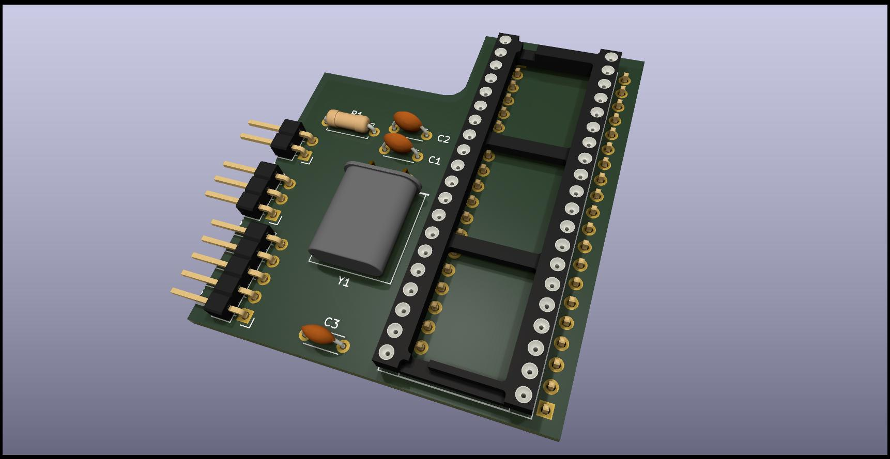

# DIREN Keyboard Interface Clone
A reverse engineering exercice using the Diren PS/2 Keyboard adapter for Sinclair QL

Licensed under Cern OHL-S - https://ohwr.org/cern_ohl_s_v2.txt

## WARNING: DO NOT USE THIS PROJECT IS NOT TESTED AND MISSING THINGS
This is not a functional item, it's only a exercice of reverse engineering to reinforce my skills in Kicad EDA Software.

This project was done using freely available pictures of the interface found on internet.

There area things that do not match on the pictures, the conection of GND and Vcc of the pictures do not match the datasheet of the chip.
in special pin 4,5 and 9 seen to be interchanges. and pin 1 seen to be conected to +5V instead of GND.

Also this project is completely useless without the firmware of the microcontroller.

## Comparative

## Reference

