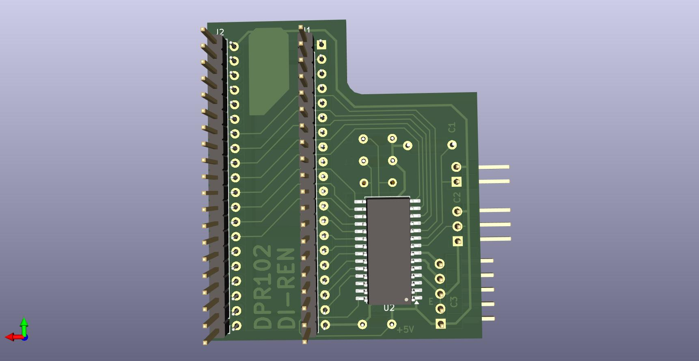

# DIREN Keyboard Interface Clone
A reverse engineering exercice using the Diren PS/2 Keyboard adapter for Sinclair QL

Licensed under Cern OHL-S - https://ohwr.org/cern_ohl_s_v2.txt

## WARNING: DO NOT USE THIS PROJECT IS NOT TESTED AND MISSING THINGS
This is not a functional item, it's only a exercice of reverse engineering to reinforce my skills in Kicad EDA Software.

This project was done using freely available pictures of the interface found on internet.

Schematic shall be correct, and pins are wired and the schematic has sense.

Also this project is completely useless without the firmware of the microcontroller.

## Firmware

This is what is expect on the firmware, is only my guest:

Firmware configure port B as input and assing a interrupt to the port

Normally only 1 of the lines as tied to 0V at the same time, to indicate the row of keyboard to read.

Firmware configure port C as input to have high impedance.

In the main loop a variable store the actual key pressed and the controls keys.

When a interrupt is detected, a look-up table determine if the key pressed (if any) is related to the port B line that trigged the interrupt.
If related, a second look-up table determine the port C line that need to be activate.
then reconfigure the KBO line as output and tie to 0V.

As soon as the Port B line go high, reconfigure again the KBO line as input.

In the main loop of the microcontroller, comunication with keyboard is done, and actual key is stored in a variable.
It also has in charge to decode de other input for configuration and do the keyboard traslation of other keys.

The first row of the keyboard is the special characters, shift, control and enter, that can be pressed with other keys at same time, they are managed in separate variables.

a 3rd table will translate the 102 keys of the AT keyboard into the 64 keys of the QL.

The first table will have at leas 64 position (one for QL key) and will be used as a mask for determine if any KBO line is used by it.

A second table of 64 positions will indicate the bit of port B that need to go down on key press.

In this way, only 230 bytes of ROM area used, and only 1 byte and 3 bits are used for the keys.

## Comparative

## Reference

